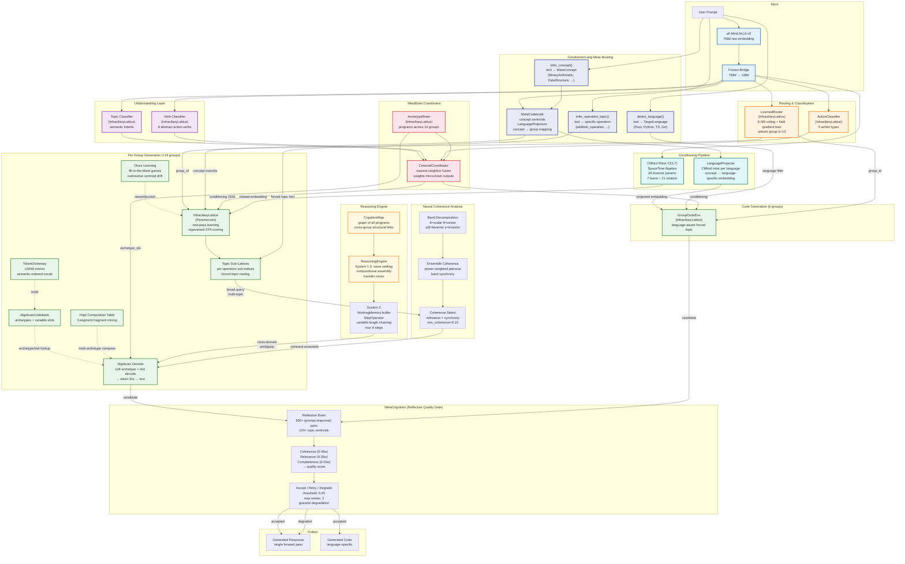
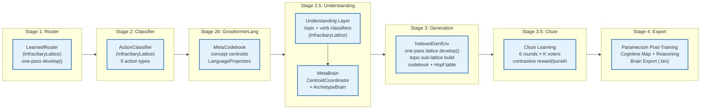
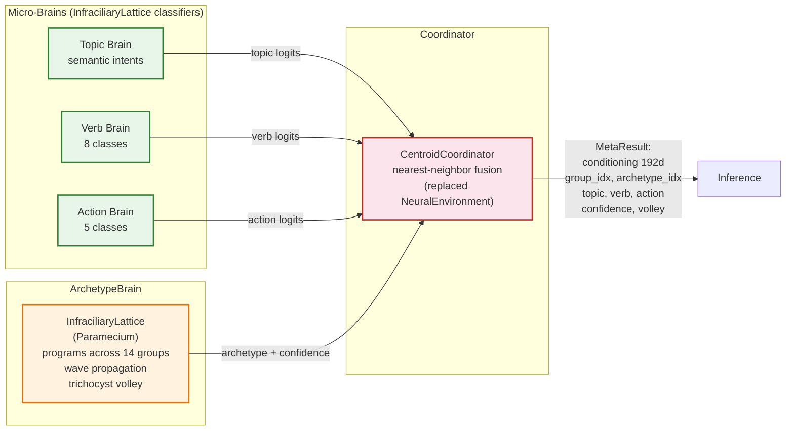

# Growformer System Architecture

## Full System Overview

## Training Pipeline

**Key change from previous architecture:** All MLP/NeuralEnvironment training has been replaced by one-pass `InfraciliaryLattice` (Paramecium) `develop()`. No backpropagation, no epochs, no iterative optimization. Training cost is O(n) where n = number of samples.

## Component Details

### Embedding & Conditioning Pipeline

| Component | Dimensions | Purpose |
|-----------|-----------|---------|
| Raw embedding (MiniLM) | 768d | Semantic representation of input text |
| Frozen bridge | 768d → 128d | Dimensionality reduction for routing |
| Clifford rotor Cl(1,7) | 28 bivector params (7 boost + 21 rotation) | SpaceTime Algebra geometric rotation |
| Understanding vector | 48d (32 topic + 16 verb) | Semantic intent conditioning |
| Language projector | 128d → 128d | Concept-to-language Clifford rotation |
| Generation conditioning | 192d total | Rotor output + understanding + zero-padding |

### SpaceTime Algebra Cl(1,7)

Upgrade from Euclidean Cl(8,0) to Minkowski-like Cl(1,7) with one timelike dimension:

| Property | Value |
|----------|-------|
| Algebra | Cl(1,7) — 1 timelike + 7 spacelike basis vectors |
| Boost bivectors | 7 (e₀∧eᵢ) — encode causal/temporal direction |
| Rotation bivectors | 21 (eᵢ∧eⱼ) — encode spatial/structural relations |
| Timelike dimension | e₀ carries `goal_magnitude` from UnderstandingLayer |
| Causal fingerprint | 7d boost bivector extraction |
| Spatial fingerprint | 21d rotation bivector extraction |

The timelike dimension encodes the "goal direction" of a prompt — how strongly the input drives toward action (high goal_magnitude for "write a function" vs. low for "what is X"). This gives embeddings a causal arrow that purely spatial algebra lacks.

### GrowformerLang (Meta-Programming Language)

A language-agnostic concept layer that separates *what* is being asked from *which programming language* it targets:

| Component | Purpose |
|-----------|---------|
| `MetaConcept` | 20+ abstract categories (BinaryArithmetic, DataStructure, TraitInterface, ...) |
| `MetaOp` | Abstract operations (Bind, BinaryOp, FnDef, Loop, PatternMatch, ...) |
| `TargetLanguage` | Rust, Python, TypeScript, Go, Generic |
| `LanguageProjector` | Per-language Clifford rotor mapping concept → language-specific embedding |
| `MetaCodebook` | Maps MetaConcepts to centroids, group indices, and per-language projectors |
| `infer_concept()` | Text → MetaConcept (uses action_target as ground truth during training) |
| `infer_operation_topic()` | Text → specific operation name (e.g., "subtraction_operation") |
| `detect_language()` | Text → TargetLanguage from keyword signals |

**Two-stage routing:**
1. `infer_concept()` classifies the abstract concept from text
2. `MetaCodebook.route_and_project()` finds the best group for that concept and applies the language-specific projector

This solved the inter-group routing problem for fine-grained coding categories.

### Topic Sub-Lattices & Forced Topic Routing

Each `IndexedGenEnv` contains multiple `TopicSubIndex` entries — small InfraciliaryLattice instances built from training samples grouped by `semantic_intent`. This provides within-group discrimination:

| Group | Topics (before) | Topics (after retagging) |
|-------|----------------|-------------------------|
| g2 (coding_arithmetic) | 1 ("coding_implementation") | 13 (addition_operation, subtraction_operation, ...) |

**Forced topic routing:** When `infer_operation_topic()` identifies a specific operation (e.g., "subtraction_operation"), the system directly queries the matching sub-lattice, bypassing cross-topic competition. This prevents high cosine similarity between sibling operations (add vs sub) from drowning out the correct result. The forced topic result is returned directly, skipping the field inhibition gate which would otherwise override it via global archetype slot inference.

**Language-aware code generation:** `forced_topic_response_lang()` accepts a language hint and filters sub-lattice programs by language-specific code markers (`fn ` for Rust, `def ` for Python), ensuring the generated code matches the requested language.

### Within-Group Equivariant Scoring

`nearest_response_in_lattice()` uses full multivector geometry instead of scalar cosine:

| Component | Weight | What it captures |
|-----------|--------|-----------------|
| Scalar cosine | 30% | Overall similarity (invariant) |
| Spatial bivector alignment | 35% | Rotation structure match (equivariant) |
| Causal bivector alignment | 20% | Temporal/goal direction match (equivariant) |
| Proximity (inverse distance) | 15% | Embedding space closeness |

Equivariant features preserve orientation and phase, enabling discrimination between operations that share the same symmetry class (e.g., add vs sub within arithmetic).

### Cloze (Fill-in-the-Blank) Learning

Post-lattice-development reinforcement that teaches programs to infer slot content from input semantics:

| Parameter | Value |
|-----------|-------|
| Rounds | 6 per group |
| K voters | 7 nearest programs |
| Reward rate | 0.10 (centroid drift toward correct) |
| Punish rate | 0.06 (contrastive: repel from wrong + attract toward own centroid) |

**Contrastive punishment:** Incorrect programs are simultaneously repelled *away* from the wrong input and attracted *toward* their original centroid. This creates sharper boundaries between related operations within the same group.

### Reasoning Engine

Cross-domain compositional inference using the CognitiveMap:

| Component | Purpose |
|-----------|---------|
| CognitiveMap | Graph of all programs across all groups, connected by structural similarity |
| ReasoningEngine (System 1.5) | Multi-group activation, wave settling (4 rounds), compositional assembly |
| System 2 (`reason_deliberate()`) | Variable-length deliberate chaining with WorkingMemory + StepOperator |
| Transfer rotors | Clifford rotors mapping structure from one domain to another (analogical reasoning) |
| `should_reason()` | System 1.5 heuristic: triggers when multi-group activation is ambiguous |
| `should_reason_deliberate()` | System 2 heuristic: triggers when confidence is 0.10–0.65 AND cross-domain ambiguity > 0.70 |

### MetaCognition (Reflective Quality Gate)

Post-generation quality evaluation via a generate-reflect-decide loop. Addresses content bleed, wrong-archetype selection, and low-confidence garbage.

| Component | Purpose |
|-----------|---------|
| `MetaCognition` (`src/metacognition.rs`) | Reflection brain trained from (prompt, response, topic) triples |
| `ReflectionScores` | Coherence (0.45w), relevance (0.35w), completeness (0.20w) → quality score |
| `ReflectionOutcome` | Accept (quality ≥ 0.45) / Retry (adjust conditioning, max 2) / Degrade (structured "I don't know") |
| Graceful degradation | When all retries fail, emits topic-specific "outside my training scope" message |
| `rebuild_metacognition()` | Automatically reconstructs from brain data on `load_brain()` |

**Training:** During brain training, every lattice program across all 14 gen + 7 code groups contributes a (prompt_emb, response_emb, topic) triple. The reflection brain learns per-topic centroids of what good (prompt, response) pairs look like in joint embedding space. At inference, the candidate response's joint embedding is measured against the appropriate topic centroid.

**Inference flow:** System 1 generates → MetaCognition evaluates → Accept/Retry/Degrade.

### System 2 Reasoning (Deliberate Multi-Step Chaining)

Extends the ReasoningEngine from fixed-round wave settling to variable-length deliberate chaining. Each step is a single lattice query or rotor application — no backprop, no autoregressive token loop.

| Component | Purpose |
|-----------|---------|
| `WorkingMemory` | Bounded scratchpad (capacity=8) of activated programs + partial conclusions |
| `StepOperator` | Decides next action: Retrieve / Transfer / Compose / Terminate |
| `Retrieve` | Query a structurally related group to diversify working memory |
| `Transfer` | Apply Cl(1,7) transfer rotor for analogical domain mapping |
| `Compose` | Sentence-level interleaving of working memory entries |
| `Terminate` | Coherence threshold (0.65) reached OR max steps (6) OR stall detected |
| `System2Config` | Configurable: max_steps, wm_capacity, coherence_threshold, min_activation |

**Biological analog:** Prefrontal working memory + inner speech. The StepOperator is a deliberate "select what to think about next" process, unlike the automatic wave settling of System 1.5.

Neuroscience-informed mapping:

| Brain Region | Growformer Component |
|-------------|---------------------|
| Medial Prefrontal Cortex | CognitiveMap (social/moral reasoning) |
| Temporoparietal Junction | UnderstandingLayer (theory of mind, semantic understanding) |
| Anterior Cingulate Cortex | MetaCognition (error monitoring, conflict detection) |
| Dorsolateral Prefrontal Cortex | System 2 WorkingMemory + StepOperator (deliberate reasoning, planning) |
| Inhibition | Causal Fingerprint gating (suppress irrelevant information) |
| Cross-cortical EEG Coherence | Neural Coherence Analysis (band-decomposed STA synchrony for ensemble composition) |

### Neural Coherence Analysis

Inspired by EEG coherence in neuroscience, where synchrony of neural oscillations across brain areas indicates functional connectivity. Growformer maps the Cl(1,7) SpaceTime Algebra grade structure to frequency bands:

| Band | STA Grade | Components | Analogy |
|------|-----------|------------|---------|
| δ (delta) | Grade 0 (scalar) | 1 | Global activation level alignment |
| θ (theta) | Grade 1 (vectors) | 8 | Intentional direction synchrony |
| α/β boost | Grade 2 (boost bivectors) | 7 | Temporal/causal coherence |
| α/β spatial | Grade 2 (rotation bivectors) | 21 | Structural/relational pattern synchrony |
| γ (gamma) | Grade 3 (trivectors) | 56 | Fine-grained semantic binding |

**Key neuroscience insight:** Coherence is primarily determined by the "sending" region (the source program's embedding quality), not just pairwise similarity. Programs with strong, well-defined grade-specific activations produce reliable coherence signals.

| Component | Purpose |
|-----------|---------|
| `BandCoherence` | Per-band coherence scores between two programs |
| `BandPower` | Signal strength per band for a single program (spectral power density) |
| `ensemble_coherence()` | Power-weighted mean pairwise coherence across a program set |
| `coherence_select()` | Greedy selection maximizing both relevance AND ensemble coherence |
| `coherence_matrix()` | Pairwise coherence matrix between topic sub-lattice centroids |

**Used for:** Broad query summarization — when a categorical question (e.g., "What is software architecture?") requires composing from multiple topic sub-lattices, coherence-guided selection ensures the chosen programs synchronize into a coherent ensemble rather than a disconnected list.

**Diagnostic gating:** If ensemble coherence falls below 0.15, the system recognizes it cannot compose a coherent multi-topic response and falls back to single-program retrieval. This mirrors how low cross-regional coherence in EEG indicates disconnected processing.

### MetaBrain Architecture

### Data Groups (14 dynamic specialist domains)

Groups are dynamically discovered from unique `action_target` values in training data. Current layout:

| Group | Role | Gen Programs | Code Programs | Topic Sub-Lattices |
|-------|------|-------------|--------------|-------------------|
| g0 | Support/conversation | 65 | — | 11 |
| g1 | Search algorithms | 17 | 17 | 4 |
| g2 | Coding arithmetic | 21 | 18 | 13 |
| g3 | Data structures | 17 | 14 | 5 |
| g4 | Coding patterns | 90 | 56 | 17 |
| g5 | Sort algorithms | 28 | 24 | 5 |
| g6 | General conversation | 59 | — | 42 |
| g7 | Safety | 28 | — | 10 |
| g8 | Technical advice | 67 | — | 8 |
| g9 | Reasoning/composition | 18 | — | 19 |
| g10 | General knowledge | 149 | — | 31 |
| g11 | Architecture patterns | 140 | — | 14 |
| g12 | Design patterns | 44 | 20 | 11 |
| g13 | Multi-turn | 23 | — | 4 |

### Paramecium (InfraciliaryLattice)

The universal inference primitive — replaces all MLP/NeuralEnvironment components:

- **One-pass learning:** `develop()` creates behavioral programs from (embedding, text) pairs in O(n)
- **Wave propagation:** Input activates programs; activation spreads through the lattice
- **EMA centroid drift:** Program centroids adapt to input distribution (frozen after training)
- **Habituation:** Frequently-activated programs attenuate (novelty seeking)
- **Trichocyst volley:** Multi-program composition via ranked activation burst
- **Equivariant scoring:** Full STA multivector geometry for within-group discrimination

Used for: Router, ActionClassifier, Understanding Layer (topic/verb), ArchetypeBrain, all generation envs, all code envs, topic sub-lattices.

### Generation Architecture (Per-Group)

- **No autoregression:** Entire response predicted in a single forward pass
- **No backpropagation:** One-pass lattice development, O(n) training cost
- **Per-group isolation:** Each domain has its own `IndexedGenEnv`, `TokenDictionary`, and `AlgebraicCodebook`
- **Topic sub-lattices:** Within-group discrimination via operation-specific sub-indices
- **Forced topic routing:** Direct sub-lattice query when operation is known, bypassing cross-topic competition
- **Language-aware code gen:** Sub-lattice program filtering by target language markers
- **Algebraic codebook:** Responses clustered into archetypes (fixed tokens + variable slots)
- **Semantic token dictionary:** Vocabulary ordered by co-occurrence similarity + Gray coding
- **Hopf composition:** Multi-archetype responses via fragment mixing
- **Cloze learning:** Post-training contrastive reinforcement for slot inference

### E8 Lattice Quantization + Quantum Composition

The 128d bridge embedding decomposes into 16 × 8d subspaces, each quantized to the **E8 lattice** (densest sphere packing in 8d).

| Property | Value | Usage |
|----------|-------|-------|
| Dimension | 8 per subspace | Bridge 128d = 16 × 8d |
| Kissing number | 240 | Max equidistant archetype neighbors |
| Decoding | O(8) per subspace | Replaces O(n×d) cosine scan |
| Error correction | Extended Hamming [8,4,4] | 1-bit correction, 2-bit detection |

**Quantum group composition U_q(E8):** When multiple groups contribute, their E8 lattice points compose via quantum-deformed algebra with non-commutative R-matrix braiding.

### OCEAN Personality Conditioning

5-dimensional behavioral vector (each 0.0–1.0):

| Trait | Effect |
|-------|--------|
| **O**penness | Modulates Hopf cross-archetype composition (high → creative) |
| **C**onscientiousness | Biases slot prediction toward high-frequency vocab (high → precise) |
| **E**xtraversion | Influences archetype length selection (high → verbose) |
| **A**greeableness | Conditions toward affirming language patterns |
| **N**euroticism | Modulates confidence thresholds (high → cautious) |

### AI Safety Properties

1. **Bounded output space:** Codebook defines finite, enumerable response patterns. Content outside the codebook cannot be generated.
2. **Prompt injection resistance:** Adversarial inputs cause misrouting, not arbitrary text generation. Attack surface is "misselection among known patterns."
3. **Frozen deterministic inference:** Consolidated groups produce identical output for identical input across invocations, time, and hardware.

### Current Benchmark (~1600 samples, 14 groups)

| Component | Metric | Value |
|-----------|--------|-------|
| LearnedRouter | type | InfraciliaryLattice (K-NN + field gradient) |
| ActionClassifier | type | InfraciliaryLattice (one-pass) |
| MetaBrain coordinator | type | CentroidCoordinator (nearest-neighbor) |
| MetaCodebook | concepts | 20+ MetaConcepts with LanguageProjectors |
| Generation envs | groups | 14 gen + 6 code |
| Total programs | count | ~950 (gen + code) |
| Topic sub-lattices | count | ~200 across all groups |
| Cloze learning | accuracy | 94.6% slot fill (1470 games) |
| Brain checkpoint | size | ~81 MB |
| Training time | wall clock | ~27 min (one-pass, no epochs) |

Representative inference (single forward pass, no autoregression):

| Prompt | Response | Code |
|--------|----------|------|
| "write an addition function in Rust" | "Sum is the result of addition. Define a function with two parameters..." | `fn sum(a: f64, b: f64) -> f64 { a + b }` |
| "write a subtraction function in Rust" | "The difference of two numbers is computed by subtracting..." | `fn difference(a: f64, b: f64) -> f64 { a - b }` |
| "write a multiplication function in Rust" | "The product of two numbers is computed by multiplication..." | `fn product(a: f64, b: f64) -> f64 { a * b }` |
| "implement binary search in Python" | "Use two pointers converging toward the middle..." | `def binary_search(arr, target): lo, hi = 0, len(arr)-1 ...` |
| "help me reset my password" | "Password reset links expire after 30 minutes..." | — |
| "implement a stack using an enum in Rust" | "Use an enum with Box for heap allocation..." | `enum List<T> { Nil, Cons(T, Box<List<T>>) } ...` |

### Continual Learning (Split-MNIST, zero forgetting)

| Task | Digits | Accuracy | After All 5 Tasks | Forgetting |
|------|--------|----------|-------------------|------------|
| 0 | 0 vs 1 | 97.6% | 97.6% | 0% |
| 1 | 2 vs 3 | 96.7% | 96.7% | 0% |
| 2 | 4 vs 5 | 98.6% | 98.6% | 0% |
| 3 | 6 vs 7 | 97.1% | 97.1% | 0% |
| 4 | 8 vs 9 | 96.3% | 96.3% | 0% |
| **Avg** | | **97.3%** | **97.3%** | **0%** |

### File Map

| File | Component |
|------|-----------|
| `src/service.rs` | LanguageService: generation, codegen, meta-routing integration |
| `src/main.rs` | Training pipeline: all stages, cloze learning, brain export |
| `src/dimension/group_gen.rs` | IndexedGenEnv, topic sub-lattices, forced topic routing, equivariant scoring |
| `src/dimension/router.rs` | LearnedRouter (InfraciliaryLattice, K-NN + gradient bias) |
| `src/dimension/manager.rs` | DimensionManager, Clifford conditioning, structural fingerprints |
| `src/dimension/paramecium.rs` | InfraciliaryLattice (Paramecium): wave propagation, develop, respond |
| `src/growformer_lang.rs` | GrowformerLang: MetaConcept, MetaCodebook, LanguageProjector |
| `src/reasoning.rs` | CognitiveMap, ReasoningEngine (System 1.5), System 2 (WorkingMemory, StepOperator), transfer rotors |
| `src/metacognition.rs` | MetaCognition: Reflection Brain, ReflectionScores, graceful degradation |
| `src/coherence.rs` | Neural Coherence Analysis: band-decomposed STA coherence, ensemble selection, diagnostic gating |
| `src/cloze.rs` | Cloze learning: fill-in-the-blank games, contrastive drift |
| `src/understanding.rs` | UnderstandingLayer: topic/verb classifiers, goal_magnitude |
| `src/clifford.rs` | Cl(1,7) STA: multivectors, rotors, fingerprints, embed_bridge_vector |
| `src/meta_brain.rs` | MetaBrain: CentroidCoordinator, ArchetypeBrain fusion |
